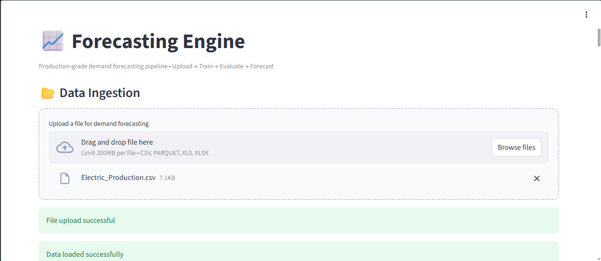
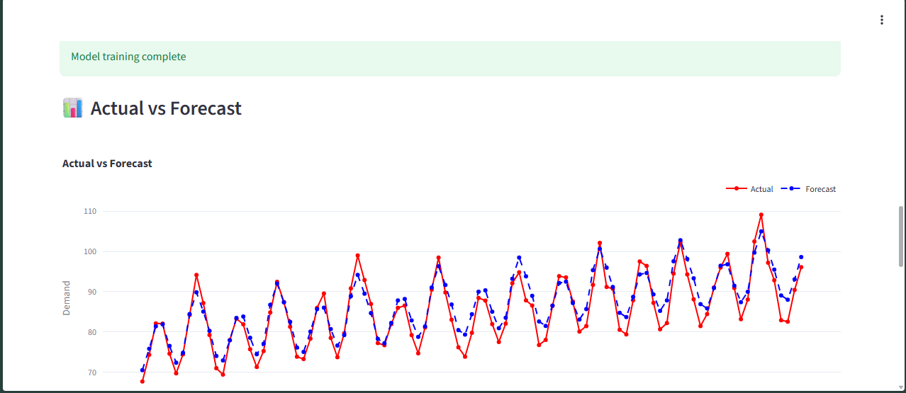
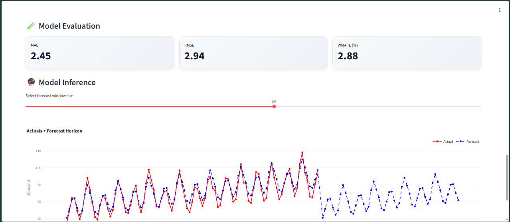

# 📈 Forecasting Engine

A **general-purpose time series forecasting engine** that ingests user
data and automatically produces reliable forecasts with evaluation and
interactive visualizations --- deployed using **Docker + AWS EC2** and
accessible over the internet via **Streamlit**.

------------------------------------------------------------------------

## 🚀 Live Deployment

The application is fully containerized and deployed:

-   🐳 Dockerized application
-   📦 Image pushed to **Docker Hub**
-   ☁️ Pulled and run on **AWS EC2**
-   🌍 Publicly accessible via browser
-   ⚡ Powered by **Streamlit**

------------------------------------------------------------------------

## 🎯 Objective

Build a **plug-and-play forecasting engine** that:

-   Accepts **any dataset** with a datetime column and target column
-   Handles multiple **frequencies** (hourly, daily, weekly, monthly,
    quarterly, yearly)
-   Performs **data cleansing, continuity checks, and imputation**
-   Trains forecasting models and selects the **best-performing model**
-   Produces **interactive visualizations** and evaluation metrics

------------------------------------------------------------------------

## 🧾 Key Inputs

-   Datetime column (user-mapped)
-   Datetime format (user-selected)
-   Target / demand column
-   Data frequency
-   Forecast horizon

------------------------------------------------------------------------

## 🔄 Data Processing Pipeline

1.  **Data Ingestion**
    -   CSV / Excel / Parquet upload via Streamlit
2.  **Column Mapping**
    -   User maps datetime and target columns
    -   Frequency selection
3.  **Data Cleansing**
    -   Datetime coercion
    -   NaN / NaT handling
    -   Duplicate removal
    -   Negative value handling
4.  **Continuity Check**
    -   Detects missing timestamps based on frequency
5.  **Temporal Imputation**
    -   Reindexing to a complete datetime grid
    -   Missing values filled (default: zero-fill)
6.  **Preprocessing**
    -   Outlier handling (Winsorization / capping)
    -   Stationarity check (ADF test)
    -   Differencing (if required)

------------------------------------------------------------------------

## 🤖 Modeling Strategy

-   Modular model architecture with a common interface
-   Current models:
    -   SARIMAX
-   Planned:
    -   Prophet
    -   Gradient Boosting / ML models

### 📏 Model Evaluation Metrics

-   RMSE
-   MAE
-   WMAPE

The best-performing model is selected automatically.

------------------------------------------------------------------------

## 📊 Data Splitting Strategy

-   Time-series--aware cross-validation
-   Rolling splits using `TimeSeriesSplit`
-   Preserves temporal ordering

------------------------------------------------------------------------

## 📈 Visualization

-   Interactive **Plotly** charts
-   Actual vs Forecast comparison
-   Model evaluation metrics view
-   Clean UI built with **Streamlit**

------------------------------------------------------------------------

## 🖼️ Application Screenshots

### 1️⃣ Data Upload



### 2️⃣ Actual vs Forecast



### 3️⃣ Model Evaluation



------------------------------------------------------------------------

## 🐳 Docker Usage

### 🔧 Build Image (Local)

``` bash
docker build -t titanexasaur/forecasting .
```

### ▶️ Run Locally

``` bash
docker run -p 8888:8501 titanexasaur/forecasting
```

Then open:

``` text
http://localhost:8888
```

------------------------------------------------------------------------

## ☁️ AWS EC2 Deployment

### 1️⃣ SSH into EC2

``` bash
ssh -i forecasting-e2e.pem ec2-user@<EC2-PUBLIC-IP>
```

### 2️⃣ Pull Image from Docker Hub

``` bash
docker pull titanexasaur/forecasting
```

### 3️⃣ Run Container

``` bash
docker run -d -p 8501:8501 --name forecasting_engine titanexasaur/forecasting
```

### 4️⃣ Check Running Container

``` bash
docker ps
```

### 5️⃣ Access in Browser

``` text
http://<EC2-PUBLIC-IP>:8501
```

------------------------------------------------------------------------

## 🛑 Stop & Remove Container (EC2)

``` bash
docker stop forecasting_engine
docker rm forecasting_engine
```

------------------------------------------------------------------------

## 🛠 Tech Stack

-   Python
-   Pandas, NumPy
-   Statsmodels
-   Scikit-learn
-   Plotly
-   Streamlit
-   Docker
-   AWS EC2

------------------------------------------------------------------------

## 📦 Deployment Flow

1.  Build Docker image locally
2.  Push image to Docker Hub
3.  Pull image on AWS EC2
4.  Run container exposing Streamlit port
5.  Access app via EC2 Public IP

------------------------------------------------------------------------

## 🌟 Vision

A **production-ready, extensible forecasting engine** usable across
domains with minimal configuration, strong statistical foundations, and
cloud-native deployment.
